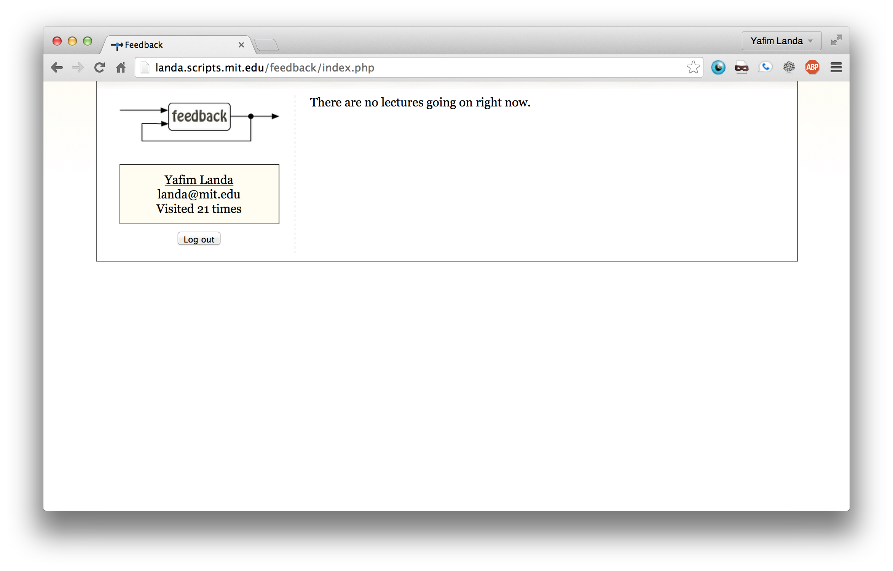

feedback
========

Lets instructors get questions or feedback mid-lecture

This application was used in some of the 6.470 lectures that I gave.

This code is really old &mdash; I pulled it from my MIT home directory after graduation.
